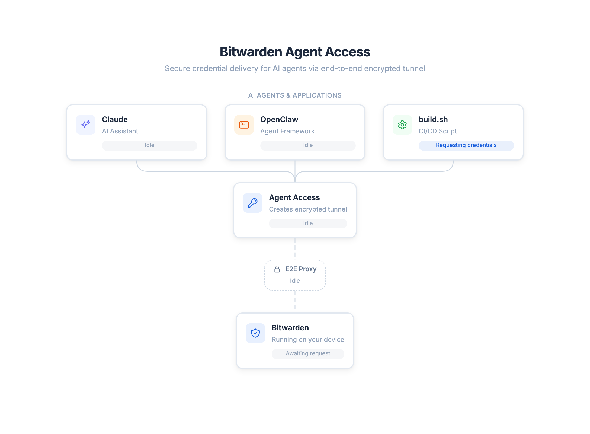
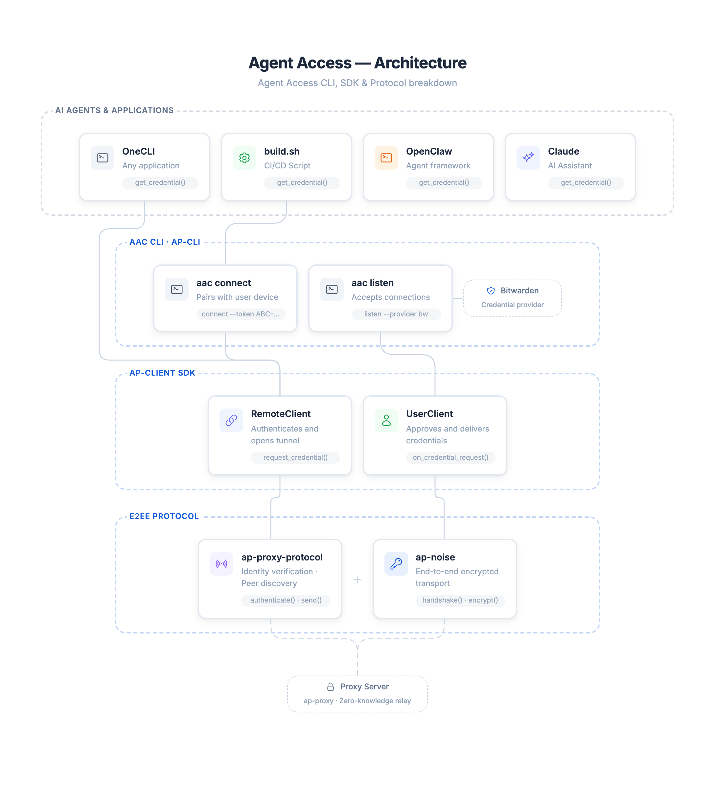

<p align="center">
  <picture>
    <source media="(prefers-color-scheme: dark)" srcset="assets/logo-dark.svg">
    <source media="(prefers-color-scheme: light)" srcset="assets/logo-light.svg">
    
  </picture>
</p>


# Agent Access

Agent Access allows users to access credentials from their password manager on remote systems, without exposing their entire vault.
It creates an end-to-end encrypted tunnel between the remote system and the password manager.

Agent Access is an open protocol, CLI tool, and Rust SDK that you can use to implement it directly into agents or custom software. While we at Bitwarden have built it, it's open for any password manager to leverage to further support agentic or automation use cases without exposing your entire vault.

> [!IMPORTANT]
> This project is in an **early preview stage**. APIs and protocols are subject to change. We do not recommend inputting sensitive credentials directly into LLMs or AI agents (any unknown software, really).
> 
> For LLM's specifically, where possible use environment injection (e.g. `aac run`) to pass secrets to processes without exposing them in recorded context.

<p align="center">
  <picture>
    <source media="(prefers-color-scheme: dark)" srcset="assets/overview-dark.webp">
    <source media="(prefers-color-scheme: light)" srcset="assets/overview-light.webp">
    
  </picture>
</p>

## Installation

### macOS (Apple Silicon)

```shell
curl -L https://github.com/bitwarden/agent-access/releases/latest/download/aac-macos-aarch64.tar.gz | tar xz
sudo mv aac /usr/local/bin/ # Makes it available on PATH
```

### macOS (Intel)

```shell
curl -L https://github.com/bitwarden/agent-access/releases/latest/download/aac-macos-x86_64.tar.gz | tar xz
sudo mv aac /usr/local/bin/ # Makes it available on PATH
```

### Linux (x86_64)

```shell
curl -L https://github.com/bitwarden/agent-access/releases/latest/download/aac-linux-x86_64.tar.gz | tar xz
sudo mv aac /usr/local/bin/ # Makes it available on PATH
```

### Windows (x86_64)

Download [aac-windows-x86_64.zip](https://github.com/bitwarden/agent-access/releases/latest/download/aac-windows-x86_64.zip) from the [latest release](https://github.com/bitwarden/agent-access/releases/latest) and extract it to a directory on your PATH.

### OpenClaw skill

```shell
curl -fsSL "https://raw.githubusercontent.com/bitwarden/agent-access/main/examples/skills/agent-access/SKILL.md" -o ~/.openclaw/skills/agent-access/SKILL.md --create-dirs
```

## Examples

* [OpenClaw skill](examples/skills/agent-access/SKILL.md)
* [Fetch credential via `aac connect`](examples/shell/get-credential.sh) — parse JSON output with `jq` and pipe to `docker login`
* [Connect to PostgreSQL via `aac run`](examples/shell/psql-connect.sh) — inject `PGUSER`/`PGPASSWORD` as env vars directly into `psql`
* [Github Action](examples/github-action/)

### Use from your code

Use Agent Access directly from your code by referencing the rust sdk. Here's an example using Python via PyO3 bindings to request credentials over the end-to-end encrypted tunnel.

```python
from agent_access import RemoteClient

client = RemoteClient("python-remote")
client.connect(token="ABC-DEF-GHI")
cred = client.request_credential("example.com")
print(cred.username, cred.password)
client.close()
```

## Getting started (Bitwarden CLI)

In this short guide we'll walk you through setting up Agent Access on your local machine and connect it to the bitwarden CLI.

**Prerequisites**

- [Bitwarden CLI](https://bitwarden.com/help/cli/) (`bw`) installed and available on your PATH

**Enabling Agent Access for Bitwarden**

The `aac` CLI tool has built-in support for connecting to the Bitwarden CLI. The interactive CLI can be used to unlock your vault (`/unlock`) and create a pairing token that the remote side can use to connect.

```shell
aac listen
```

The interactive CLI will create a pairing token that you can use to establish a connection on the remote side.

**Setting up the remote side**

You can run the remote side interactively (Useful for testing/demonstration) or without interactivity which is useful for agents and automation.

```shell
# interactive mode
aac connect
```

```shell
# Pairing (without interactivity)
aac connect --token <pairing-token> --output json

# Fetching credentials (without interactivity)
aac connect --domain example.com --output json
aac connect --domain github.com --provider bitwarden --output json

# Pair + Fetch in one command (without interactivity)
aac connect --token <pairing-token> --domain example.com --output json

# Fetch by vault item ID instead of domain
aac connect --id <vault-item-id> --output json

# Output:
{"credential":{"notes":null,"password":"alligator5","totp":null,"uri":"https://github.com","username":"example"},"domain":"github.com","success":true}

```

### Fetching by ID

You can use `--id` instead of `--domain` to fetch a specific vault item by its unique identifier. This is useful when multiple items share the same domain, or when you know the exact item you need.

```shell
aac connect --id <vault-item-id> --output json
```

The `--id` and `--domain` flags are mutually exclusive — use one or the other.

### Running commands with credentials

The `run` subcommand fetches a credential and injects it as environment variables into a child process. Secrets never touch stdout or disk — they're passed exclusively through the child process's environment.

```shell
# Map specific credential fields to env vars
aac run --domain example.com --env DB_PASSWORD=password --env DB_USER=username -- psql

# Inject all fields with AAC_ prefix (AAC_USERNAME, AAC_PASSWORD, etc.)
aac run --domain example.com --env-all -- deploy.sh

# Combine defaults with custom overrides
aac run --domain example.com --env-all --env CUSTOM_PW=password -- deploy.sh

# Use --id instead of --domain
aac run --id <vault-item-id> --env-all -- deploy.sh
```

**Available credential fields:** `username`, `password`, `totp`, `uri`, `notes`, `domain`, `credential_id`

When using `--env-all`, each field is injected with an `AAC_` prefix (e.g., `AAC_USERNAME`, `AAC_PASSWORD`). Explicit `--env` mappings override `--env-all` defaults. At least one of `--env` or `--env-all` is required.

## Contributing

This repo contains multiple building blocks that power Agent Access.

It contains:

* An end-to-end encrypted tunnel, using Noise
* A Rust SDK for establishing a tunnel, sending requests, and responding to them
* A CLI tool for requesting / releasing credentials
* A proxy server for demo/development purposes

<p align="center">
  <picture>
    <source media="(prefers-color-scheme: dark)" srcset="assets/architecture-dark.webp">
    <source media="(prefers-color-scheme: light)" srcset="assets/architecture-light.webp">
    
  </picture>
</p>

See [CONTRIBUTING.md](CONTRIBUTING.md) for development setup, crate structure, and how to run the project.
